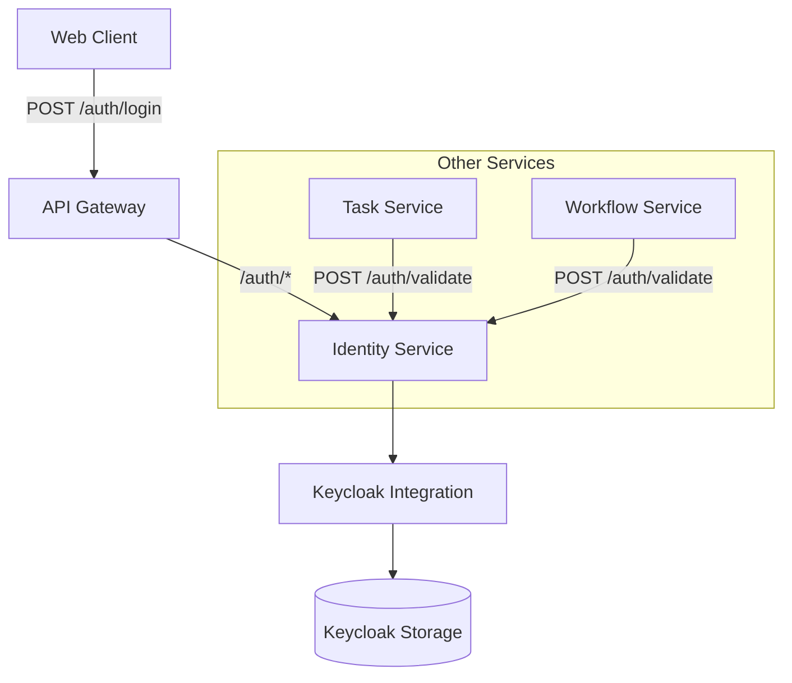

# identity
Authentication &amp; Authorization

## Component Breakdown
- **API Gateway**: Routes `/auth/*` to Identity Service
- **Authentication**: Handles `/auth/login` via Keycloak
- **Authorization**: Uses Keycloak roles embedded in JWT
- **Token Validation**: Single endpoint for all services

## IntelliJ Setup Guide

### Prerequisites
- IntelliJ IDEA 2022.3+
- Java 17 JDK (Amazon Corretto or OpenJDK)
- Docker Desktop (for Keycloak/RabbitMQ/DB containers)

### Step 1: Import Project
1. Open IntelliJ → "File" → "New" → "Project from Existing Sources"
2. Select `build.gradle.kts` file
3. Choose "Use Gradle wrapper" configuration
4. Wait for dependencies to sync (check progress bar in bottom-right)

### Step 2: Configure SDK
1. "File" → "Project Structure"
2. Under "Project Settings":
    - Set SDK: Java 17
    - Language level: Java 17
3. Under "Modules": Ensure Kotlin version is 1.9.20

### Step 3: Run Configuration
1. Open `IdentityApplication.kt`
2. Click green arrow next to `main()` method
3. Choose "Run 'IdentityApplication.kt'"
4. Verify in console: `Started IdentityApplicationKt in X seconds`
