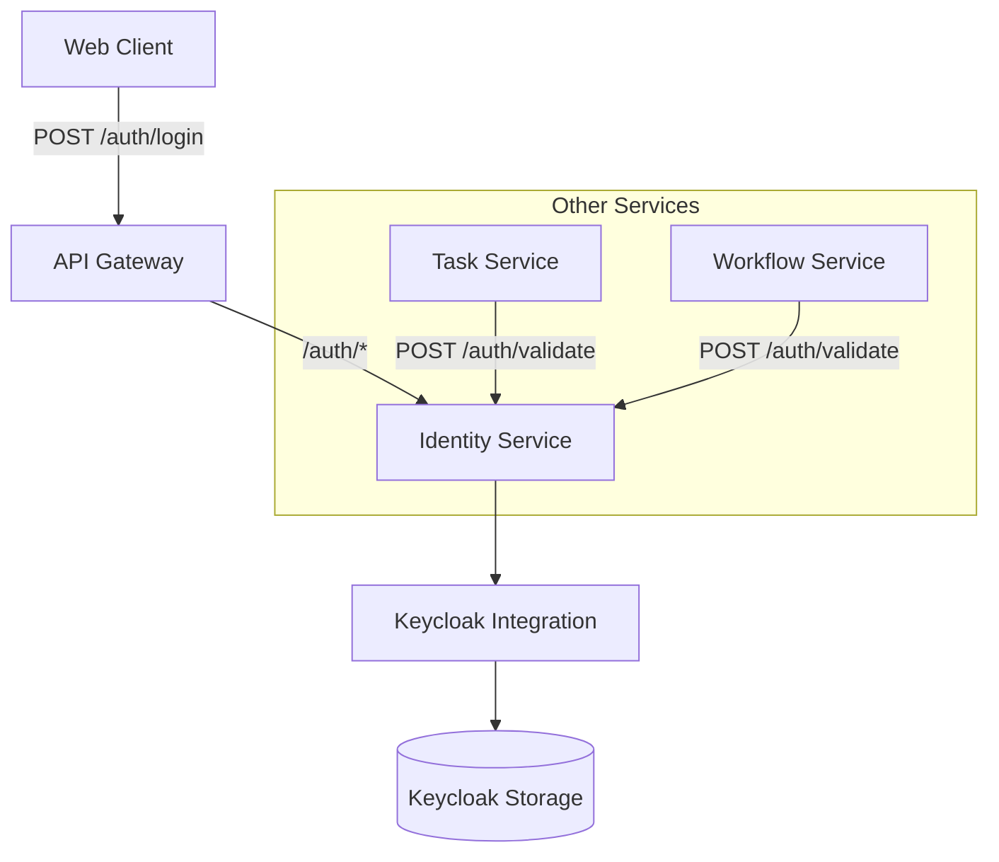

# identity
Authentication &amp; Authorization


## Component Breakdown
- **API Gateway**: Routes `/auth/*` to Identity Service
- **Authentication**: Handles `/auth/login` via Keycloak
- **Authorization**: Uses Keycloak roles embedded in JWT
- **Token Validation**: Single endpoint for all services

## IntelliJ Setup Guide

### Prerequisites
- IntelliJ IDEA 2022.3+
- Java 17 JDK (Amazon Corretto or OpenJDK)
- Docker Desktop (for Keycloak/RabbitMQ/DB containers)

### Step 1: Import Project
1. Open IntelliJ → "File" → "New" → "Project from Existing Sources"
2. Select `build.gradle.kts` file
3. Choose "Use Gradle wrapper" configuration
4. Wait for dependencies to sync (check progress bar in bottom-right)

### Step 2: Configure SDK
1. "File" → "Project Structure"
2. Under "Project Settings":
    - Set SDK: Java 17
    - Language level: Java 17
3. Under "Modules": Ensure Kotlin version is 1.9.20

### Step 3: Run Configuration
1. Open `IdentityApplication.kt`
2. Click green arrow next to `main()` method
3. Choose "Run 'IdentityApplication.kt'"
4. Verify in console: `Started IdentityApplicationKt in X seconds`


## Keycloak Development Setup Guide

### Prerequisites
- Docker and Docker Compose installed
- `make` installed (usually pre-installed on Linux/macOS)
- `curl` for verification

### Setup Instructions

#### 1. Configure Environment Variables
```bash
# Copy the example file
cp .env.example .env.dev
```

Update these values in `.env.dev`:
```
CLIENT_SECRET=your-client-secret-here   # From Keycloak client setup
ADMIN_PASSWORD=admin                    # Leave it as is
TEST_USERNAME=dev-user                  # Your username
TEST_PASSWORD=dev-password              # Your password
```

> ⚠️ **Never commit `.env.dev` to version control!**

#### 2. Start Keycloak
```bash
# Start Keycloak with dev realm
make keycloak-up
```

Look for this in docker logs to confirm successful import:q
`Imported realm 'tb-dev' from file /opt/keycloak/data/import/realm-import.json`

#### 3. Verify Setup
Run this curl command to test authentication:
```bash
curl -X POST "http://localhost:8081/realms/tb-dev/protocol/openid-connect/token" \
  -H "Content-Type: application/x-www-form-urlencoded" \
  -d "client_id=tb-identity" \
  -d "client_secret=$(grep CLIENT_SECRET .env.dev | cut -d '=' -f2)" \
  -d "grant_type=password" \
  -d "username=$(grep TEST_USERNAME .env.dev | cut -d '=' -f2)" \
  -d "password=$(grep TEST_PASSWORD .env.dev | cut -d '=' -f2)"
```

**Successful Response:**
```json
{
  "access_token": "eyJhbGci...",
  "refresh_token": "eyJhbGci...",
  "expires_in": 300,
  "refresh_expires_in": 1800
}
```

### Admin Console Access
- **URL:** http://localhost:8081/admin
- **Username:** `admin`
- **Password:** Value of `ADMIN_PASSWORD` in `.env.dev`

### Test Users (Pre-configured)
| Username | Password     | Roles      |
|----------|--------------|------------|
| `hina`   | `hina1234`   | `creator`  |
| `ashish` | `ashish1234` | `approver` |
